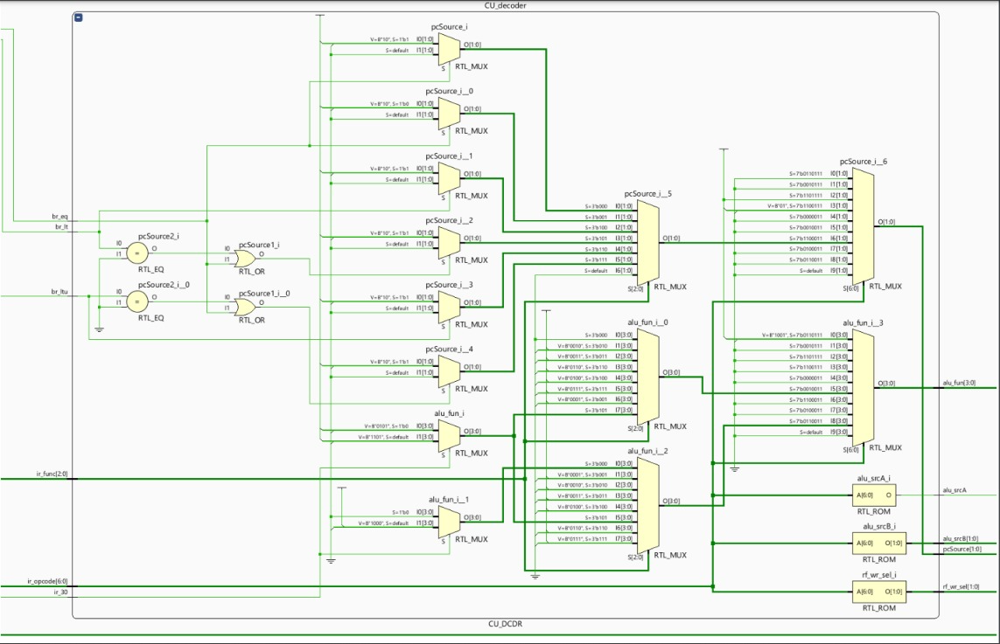
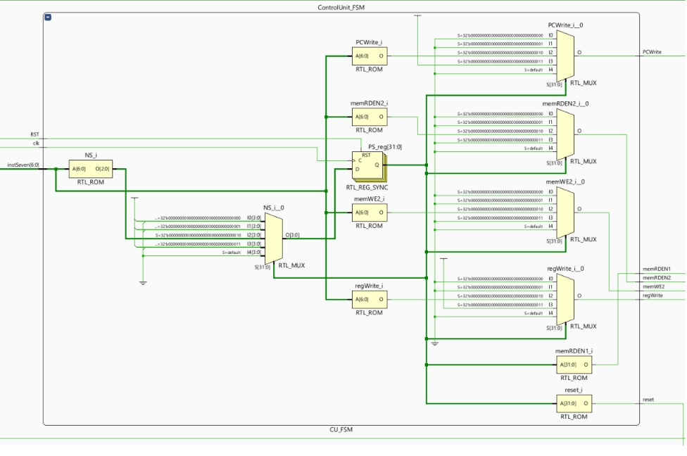

# OTTER
This repository contains the source code and implementation files for a 100 mega hertz processor designed using system Verilog. The code has been programmed onto the Basys 3 board, allowing for physical testing and verification of the processor's functionality.

## OTTER architecture

### Full architecture elaborate design with all the components linked together
.png)

### Left half elaborate design with all the components linked together
.png)

### Right half right half elaborate design with all the components linked together
.png)

### Control Unit Decoder elaborate design with all the components linked together

### Control unit Finite state machine elaborate design with all the components linked together

